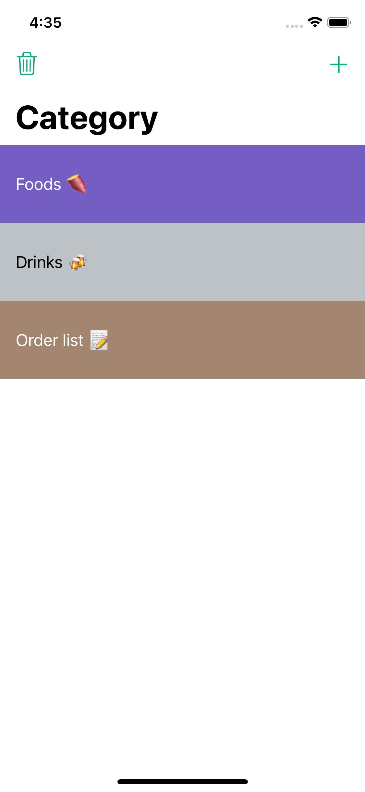
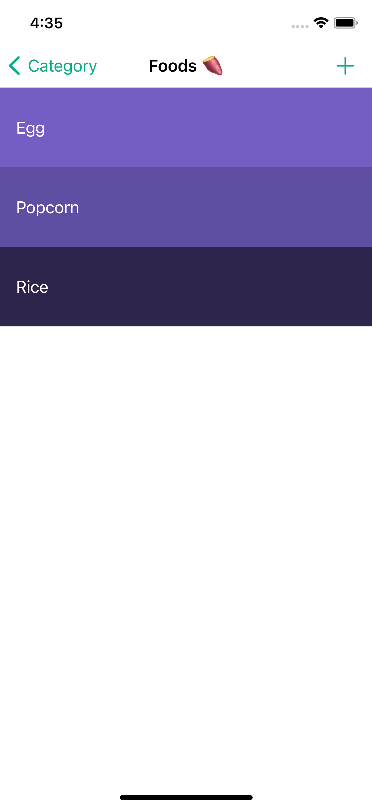

# Todoey

Todoey app lets you save your To-Do things into categories, to keep track of them easier. It has a simple and beautiful design.

I used Core Data and Realm frameworks to save items. The last commit uses Realm, you can uncomment the Core Data codes and commenting the Realm codes to enable Core Data.

</img>
</img>
